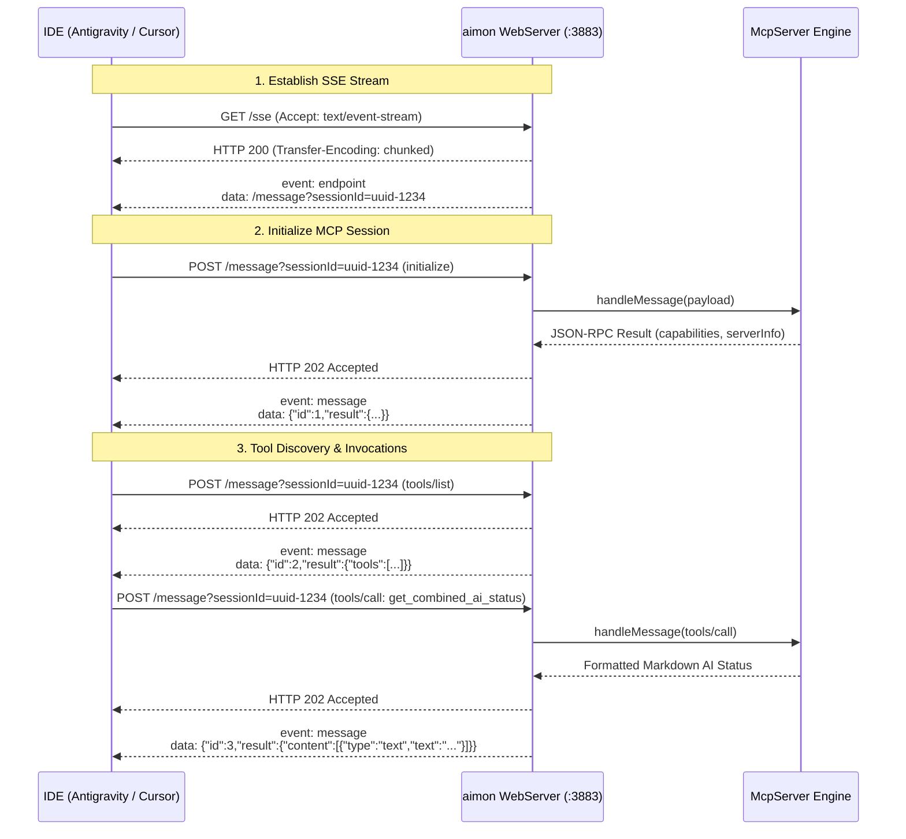

# aimon: Architectural Design & Technical Specification

## 1. Executive Summary & Problem Statement

### 1.1 Context
Modern software engineering workflows increasingly rely on AI pair programming assistants such as **Google Antigravity** and **Cursor**. Both platforms enforce subscription tiers and rate limits:
* **Antigravity** employs a dual-limit rolling quota architecture: a short-term rolling window (5-hour refresh) alongside weekly model group caps.
* **Cursor** enforces monthly fast-request pools, usage-based caps, and billing period cycles.

### 1.2 The Problem
1. **Network-Restricted Web Access**: In enterprise configurations, Cursor's web dashboard (`cursor.com/settings`) is frequently protected by corporate Single Sign-On (SSO) and strict IP-allowlisting policies. Developers working remotely or off-network cannot access the web dashboard to inspect remaining requests or billing status.
2. **Quota Invisibility in Editors**: Antigravity's weekly limits and specific model quota states are not always prominent in the main IDE editing canvas, risking abrupt mid-sprint lockouts.
3. **Fragmented Monitoring**: Developers must switch between multiple interfaces or check disparate menus to assess their available AI capacity.

### 1.3 The Solution
`aimon` is a unified, privacy-first, pure C++17 monitoring engine and Model Context Protocol (MCP) server. It operates entirely on the developer's local workstation, extracting metrics directly through:
* The **Cursor Desktop API** using locally cached session credentials (`api2.cursor.sh`), bypassing corporate web SSO geofences.
* The **Antigravity Language Server** via local loopback HTTPS Connect-RPC (`127.0.0.1`).

It delivers these metrics through three complementary interfaces:
1. **MCP Server (HTTP/SSE & stdio JSON-RPC 2.0)**: Direct natural-language access inside Cursor and Antigravity chat agents via network Server-Sent Events (`http://<host>:3883/sse`) or local stdio.
2. **Embedded Web Dashboard**: A modern, dark-mode single-page dashboard with real-time gauges and reset countdown timers (`http://localhost:3883`).
3. **Home Assistant (MQTT)**: Native Home Assistant MQTT Auto-Discovery and telemetry publishing for viewing gauges and countdowns on Lovelace dashboards.

---

## 2. System Architecture

```mermaid
flowchart TD
    subgraph DataSources ["Data Sources"]
        AG_Proc["Antigravity Language Server<br/>(127.0.0.1 HTTPS Connect-RPC)"]
        CR_DB["Cursor Local State DB<br/>(~/.config/Cursor/User/.../state.vscdb)"]
        CR_API["Cursor Desktop Backend<br/>(https://api2.cursor.sh)"]
    end

    subgraph CoreEngine ["aimon Core Engine (C++17)"]
        AGC["Antigravity Collector<br/>(Process discovery + RPC client)"]
        CRC["Cursor Collector<br/>(SQLite extractor + HTTP client)"]
        Cache["In-Memory State Store<br/>(Thread-safe, mutex-protected)"]
        Hist["History & Diff Store<br/>(SQLite3 time-series cache)"]
        Worker["Adaptive Polling Worker<br/>(5m base / 10m idle backoff)"]
    end

    subgraph Interfaces ["Presentation Surfaces"]
        MCP["MCP Engine<br/>(JSON-RPC 2.0)"]
        Web["Embedded Web & SSE Server<br/>(cpp-httplib on port 3883)"]
        MQTT["MQTT Publisher<br/>(Home Assistant Auto-Discovery)"]
    end

    AG_Proc -->|HTTPS POST + CSRF| AGC
    CR_DB -->|SQLite3 Read| CRC
    CRC -->|Bearer Auth POST| CR_API
    CR_API --> CRC

    AGC --> Cache
    CRC --> Cache
    Cache --> Hist
    Worker --> AGC
    Worker --> CRC

    Cache --> MCP
    Cache --> Web
    Cache --> MQTT
    MCP <-->|SSE Dispatch| Web

    Web -.->|HTTP / SSE| IDE_Remote["IDEs: Antigravity & Cursor<br/>(/sse & /message)"]
    Web -.->|HTTP / REST| Browser["Web Browser (localhost:3883)"]
    MCP -.->|stdio (optional)| LocalCLI["Local CLI Subprocess"]
    MQTT -.->|MQTT:1883| HA["Home Assistant (Lovelace Cards)"]
```

---

## 3. Data Collection Mechanics

### 3.1 Antigravity Local Collector

#### Discovery Mechanism
The Antigravity IDE runs a background language server binary (`language_server_linux_x64` or platform equivalent). To communicate with it without hardcoded parameters, `aimon` performs runtime discovery:
1. **PID & CSRF Token Extraction**:
   - Inspects the Linux process table via `/proc` or `ps aux`.
   - Matches the process binary name `language_server`.
   - Extracts the `--csrf_token <UUID>` command-line argument.
2. **Loopback Port Discovery**:
   - Reads the listening sockets associated with the discovered PID via `/proc/<pid>/net/tcp` or `ss -tlpn`.
   - Filters for bound addresses matching `127.0.0.1:<port>`.

#### RPC Protocol
* **Protocol**: Connect-RPC (gRPC-JSON over HTTPS with self-signed certificate).
* **Endpoint**: `POST https://127.0.0.1:<port>/exa.language_server_pb.LanguageServerService/GetUserStatus`
* **Headers**:
  ```http
  Content-Type: application/json
  x-codeium-csrf-token: <discovered_csrf_token>
  ```
* **Payload**: `{}`

#### Response Parsing
The response contains structured user status:
```json
{
  "userStatus": {
    "planStatus": {
      "planInfo": {
        "planName": "Pro",
        "teamsTier": "TEAMS_TIER_PRO",
        "monthlyPromptCredits": 50000,
        "monthlyFlowCredits": 150000
      },
      "availablePromptCredits": 500,
      "availableFlowCredits": 100
    },
    "cascadeModelConfigData": {
      "clientModelConfigs": [
        {
          "label": "Gemini 3.6 Flash (Low)",
          "modelId": "gemini-3.6-flash-low",
          "quotaInfo": {
            "remainingFraction": 1.0,
            "resetTime": "2026-09-09T05:16:12Z"
          }
        },
        {
          "label": "Gemini 3.8 Flash (High)",
          "modelId": "gemini-3.8-flash-high",
          "quotaInfo": {
            "remainingFraction": 0.85,
            "resetTime": "2026-09-09T05:16:12Z"
          }
        }
      ]
    }
  }
}
```

Key metrics mapped by `aimon`:
- Tier: `userStatus.userTier.name` / `userStatus.planStatus.planInfo.planName`
- Quota Groups: Gemini and Claude/GPT rolling windows (`remainingFraction`, `resetTime`)
- Models: Array of `{ label, remainingFraction, resetTime }`

---

### 3.2 Cursor Desktop Collector

#### Corporate Firewall & SSO Bypass Rationale
Cursor's web portal (`https://cursor.com/settings`) enforces strict corporate Single Sign-On (SSO), SAML/Okta assertions, and conditional access policies (IP geofencing). However:
1. When the desktop IDE authenticates, it stores long-lived OAuth session and API tokens locally on the workstation.
2. The IDE communicates with Cursor's dedicated API server (`https://api2.cursor.sh`), which is designed for editor operations and does not enforce web portal SSO challenges.
3. By utilizing the local token to query `api2.cursor.sh`, `aimon` retrieves usage and plan statistics regardless of the user's network location.

#### Credential Extraction
`aimon` opens the SQLite3 state store located at:
`~/.config/Cursor/User/globalStorage/state.vscdb`

SQL Query:
```sql
SELECT value FROM ItemTable WHERE key = 'cursorAuth/accessToken';
```
*(Fallback checks: `cursorAuth/cachedEmail`, `cursorAuth/stripeMembershipType`).*

#### API Communication
* **Endpoint**: `POST https://api2.cursor.sh/aiserver.v1.DashboardService/GetCurrentPeriodUsage`
* **Alternative Endpoint**: `GET https://api2.cursor.sh/auth/usage`
* **Headers**:
  ```http
  Authorization: Bearer <accessToken>
  Content-Type: application/json
  ```

#### Response Mapping
- `membershipType`: Tier (e.g., `pro`, `business`, `free`)
- `numRequests`: Fast requests consumed in current period
- `maxRequestUsage`: Total allowed fast requests (e.g., 500)
- `startOfMonth`: Beginning of current billing period
- `periodEnd`: Timestamp when fast requests and usage counters reset

---

## 4. Internal Data Models & C++ Engine

### 4.1 Core Data Structures (`include/Models.hxx`)

```cpp
#pragma once
#include <string>
#include <vector>
#include <chrono>

namespace aimon {

struct ModelQuota {
    std::string model_name;
    std::string model_id;
    double remaining_fraction; // 0.0 to 1.0 (1.0 = 100%)
    std::string reset_time_iso;
    std::chrono::system_clock::time_point reset_timestamp;
};

struct AntigravityStatus {
    bool is_running = false;
    std::string plan_tier;
    std::vector<ModelQuota> models;
    std::vector<QuotaGroup> quota_groups;
    std::string error_message;
};

struct CursorStatus {
    bool is_authenticated = false;
    std::string plan_tier;
    int fast_requests_used = 0;
    int fast_requests_limit = 0;
    double on_demand_spend = 0.0;
    std::string cycle_reset_iso;
    std::string error_message;
};

struct AggregateStatus {
    std::chrono::system_clock::time_point last_updated;
    AntigravityStatus antigravity;
    CursorStatus cursor;
};

} // namespace aimon
```

### 4.2 State Management & Polling Engine
- **`StateStore`**: A thread-safe singleton holding the latest `AggregateStatus`. Access is synchronized via `std::shared_mutex` (allowing multiple concurrent readers for Web/MCP requests, with exclusive writes during polling updates).
- **`PollingWorker`**: A background thread (`std::thread`) that triggers the collectors at a configurable interval (default: 60 seconds). If an IDE is closed, the collector gracefully records `is_running = false` without throwing exceptions or blocking callers.

---

## 5. Model Context Protocol (MCP) Subsystem

### 5.1 Protocol Overview
The Model Context Protocol (MCP) enables LLMs and IDEs to discover and invoke tools using JSON-RPC 2.0 framing. `aimon` provides dual transport options:
1. **HTTP / Server-Sent Events (SSE)** (*Recommended & Default for Networked Workstations*):
   - The persistent `aimon` daemon exposes `GET /sse` and `POST /message?sessionId=<uuid>`.
   - Any IDE (Antigravity or Cursor) connects as a client directly over HTTP, eliminating child process spawning and remote shells.
2. **Standard I/O (`stdio`)** (*Local CLI / Subprocess fallback*):
   - Standard JSON-RPC over stdin/stdout via `aimon mcp`.

### 5.2 MCP Lifecycle Flow (HTTP / SSE Transport)



### 5.3 Registered Tools

| Tool Name | Parameters | Description |
| :--- | :--- | :--- |
| `check_antigravity_quota` | None | Returns per-model remaining capacity %, prompt credits, and next reset timestamps for Antigravity. |
| `check_cursor_usage` | None | Returns Cursor fast requests used vs limit, plan tier, and billing cycle reset date. |
| `get_combined_ai_status` | None | Formats a comprehensive Markdown summary table covering both assistants. |
| `register_agent_task` | `task_description` (req), `agent_name`, `current_action`, `status`, `workspace`, `task_id`, `details` | Registers or updates an active agent task and heartbeat in the in-band task registry. |
| `list_active_tasks` | `include_completed` (optional boolean, default `false`) | Returns a Markdown summary table of active agents, current actions, runtimes, and heartbeats. |

### 5.4 In-Band Task Registry Subsystem
To monitor agents across heterogeneous or distributed setups (e.g. Cursor on Windows connecting to `aimon` on Linux via SSE):
- **Thread-Safe In-Memory Registry**: `TaskRegistry` synchronizes agent task records using `std::shared_mutex`.
- **Sliding TTL Reaper**: Any task marked `running` or `waiting_for_user` that receives no updates within 10 minutes automatically transitions to `stale`.
- **SSE Lifecycle Disconnect Hook**: When an SSE client session drops, any tasks associated with that `sseSessionId` automatically transition to `disconnected`.

### 5.5 MCP Client Session Tracking & Handshake Identity Extraction
To eliminate manual agent name configuration and avoid misidentification across distributed environments:
- **Connection Handshake Inspection**: When an MCP client (Cursor on Windows, Antigravity IDE, Claude Desktop) connects to `/sse`, `WebServer` captures its remote IP and registers an active `ClientSession`.
- **Automatic Client Discovery**: Upon receiving the JSON-RPC `initialize` handshake, the server parses `params.clientInfo.name` and `params.clientInfo.version` (e.g. `Cursor` v0.45.6 or `antigravity`) and associates them with the session.
- **Authoritative Identity Inheritance**: When `register_agent_task` is called without an explicit `agent_name`, `McpServer` automatically looks up the session's verified handshake identity, ensuring accurate attribution without LLM guessing.
- **Graceful Lifecycle Removal**: When the SSE stream terminates, the session is pruned from the active session list and any associated tasks transition cleanly.

---

## 6. Embedded Web Dashboard & Visual Design

### 6.1 Server Architecture
The web dashboard is served using `cpp-httplib` with embedded static assets:
* **Port**: Configurable via `--port <port>` (default: `3883`).
* **Interface Binding**: `0.0.0.0` or `127.0.0.1` (configurable; defaults to all interfaces for LAN/remote access).
* **REST API**:
  * `GET /api/status`: Returns current `AggregateStatus` as JSON.
  * `GET /api/refresh`: Forces an immediate collector poll and returns fresh state.
  * `GET /api/history`: Returns time-series usage history.
  * `GET /api/tasks`: Returns active/completed agent tasks (`?include_completed=true`).
  * `GET /api/sessions`: Returns live connected MCP client sessions (IP, client name, version, connection duration).
  * `POST /api/tasks/register`: Registers or updates a task from HTTP clients.
  * `POST /api/tasks/complete`: Marks a task completed or failed with optional summary.
  * `POST /api/tasks/clear`: Purges all in-memory tasks and sessions.

### 6.2 Visual Aesthetics & UI Specification
The dashboard follows modern design principles:
* **Color Scheme**:
  * Background: Deep Slate Dark (`#0b0f19`) with subtle radial gradients.
  * Card Surfaces: Translucent Glassmorphism (`rgba(22, 27, 46, 0.75)`) with 1px border (`rgba(255, 255, 255, 0.08)`).
  * Brand Highlights:
    * Antigravity: Electric Teal / Cyan (`#00f2fe` to `#4facfe`).
    * Cursor: Neon Violet / Magenta (`#7928ca` to `#ff0080`).
* **Visual Components**:
  1. **SVG Radial Circular Gauges**:
     - Visualizes remaining fraction (`0%` to `100%`).
     - Animated stroke-dashoffset transitions on update.
     - Color thresholds:
       - Green / Cyan: `> 50%` remaining.
       - Amber: `20% - 50%` remaining.
       - Red / Coral: `< 20%` remaining.
  2. **Live Countdown Clocks**:
     - Javascript client calculates milliseconds between `Date.now()` and ISO reset timestamps.
     - Formats remaining duration dynamically: `HH:MM:SS` (e.g., `03h 42m 18s until refresh`).
  3. **Linear Progress Bars**:
     - Displays Cursor fast-request consumption against monthly pool.
  4. **Active Agent Fleet Table**:
     - Displays live status (🟢 Running with pulse animation, 🟡 Waiting, 🔵 Completed, ⚪ Stale).
     - Branded agent platform badges (`Cursor (Windows)` in purple/magenta, `Antigravity` in electric cyan, `CLI Worker` in emerald).
     - Monospace active action chips (e.g. `replace_file_content`, `run_command`).
     - Ticking client-side elapsed stopwatch counter (`03m 42s`) updating every second.
     - "Show Completed" filter switch and responsive table layout with empty-state handling.
  5. **Connected MCP Clients Bar**:
     - Displays real-time connected IDE badges (e.g. Cursor on Windows, Antigravity IDE) above the fleet table.
     - Shows connection duration uptime counter (`⚡ 04m 12s`), client version, and remote IP address.
     - Updates dynamically when clients connect or disconnect over SSE.

---

## 7. Execution Modes & Interfaces

`aimon` provides focused execution modes designed for developer workflows and smart home integration:

| Mode | Command | Description |
| :--- | :--- | :--- |
| **MCP Server** | `aimon mcp` | Runs as a stdio JSON-RPC 2.0 server for integration with Cursor & Antigravity agents. |
| **Web Dashboard** | `aimon web [--port P]` | Starts the embedded HTTP server and serves the visual dashboard on `localhost:3883`. |
| **Daemon** | `aimon daemon [--port P]` | Runs the background adaptive polling worker, web dashboard, and Home Assistant MQTT publisher. |

---

## 7.1 Home Assistant (HA) MQTT Integration

`aimon` automatically discovers and pushes telemetry to Home Assistant via MQTT:
1. **MQTT Auto-Discovery**: Publishes component configurations under `homeassistant/sensor/aimon/<sensor_id>/config` with device grouping:
   - Device Name: `AI Quota Monitor`
   - Model: `aimon v1.0`
2. **Sensors Exported**:
   - `sensor.aimon_ag_plan_tier` (Antigravity Plan Tier)
   - `sensor.aimon_ag_quota_<group>_<window>` (Rolling window remaining percentages)
   - `sensor.aimon_cursor_fast_requests_used` (Cursor Fast Requests Used)
   - `sensor.aimon_cursor_fast_requests_limit` (Cursor Fast Request Capacity)
   - `sensor.aimon_cursor_cycle_reset` (Cursor Billing Cycle Reset Timestamp)
3. **Lovelace Dashboard View Cards**:
   - Packaged in `ha/lovelace_cards.yaml` for instant dashboard import (circular gauge cards, progress bars, and countdown timers).

---

## 8. Security, Privacy & Reliability Considerations

1. **Workstation-Local Operation**:
   - The web server binds exclusively to `127.0.0.1`. It does not listen on public network interfaces (`0.0.0.0`).
2. **Credential Safety**:
   - Access tokens extracted from `state.vscdb` remain in volatile memory only. They are never written to disk, output to log files, or sent to any endpoint other than `api2.cursor.sh`.
3. **Resilience to Offline States**:
   - If Antigravity IDE is closed, the language server probe detects process absence and marks the provider as `Offline` without crashing the daemon.
   - If the workstation is completely offline (no internet), Cursor API calls timeout after 2 seconds and report cached state or connectivity errors cleanly.

---

## 9. Verification & Testing Matrix

| Component | Test Type | Method / Verification Criteria |
| :--- | :--- | :--- |
| **Antigravity Probe** | Integration | Validate process detection of `language_server` and successful parsing of `GetUserStatus` Connect-RPC payload. |
| **Cursor Probe** | Integration | Verify SQLite token extraction from `state.vscdb` and successful response from `api2.cursor.sh`. |
| **MCP Engine** | Protocol | Feed JSON-RPC `initialize` and `tools/call` over stdio pipe; assert well-formed JSON-RPC results. |
| **Web Server** | Functional | Verify `GET /api/status` returns valid JSON matching current editor quotas. Verify dashboard renders in browser with active countdowns. |
| **Build System** | Unit/Compile | Ensure clean compilation under GCC and Clang with `-Wall -Wextra -Werror` in C++17 mode. |
