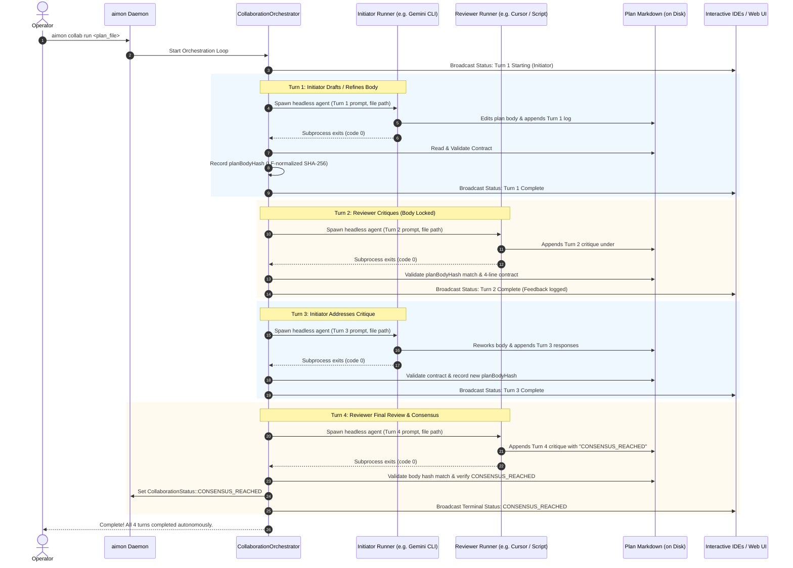

# Autonomous Inter-Agent Collaboration Orchestrator

## 1. Executive Summary & Problem Diagnosis

During the live 4-turn trial between Google Antigravity (`agent-antigravity-builder`) and Cursor (`agent-cursor-windows`), the Document-Centric Inter-Agent Collaboration Protocol successfully proved its foundational mechanics:
- The plan markdown file on disk served as the single source of truth.
- Asymmetric roles were strictly enforced (Initiator edits body and appends log; Reviewer critiques under `## Collaboration` only).
- Cross-platform LF newline normalization eliminated false SHA-256 mismatches across Linux and Windows mounts.
- Consensus was reached and terminal state was achieved.

### The Architectural Flaw: The Incomplete "Doorbell" Abstraction
However, the user experience was severely burdened because the operator had to manually intervene and relay prompts to each agent on every single turn. 

A "doorbell" (`agent_wait_turn` condition variable or MCP SSE event) can only notify an **already-running, blocked agent process**. Once an interactive IDE agent finishes generating its turn response, its execution terminates and it yields back to the human prompt. A doorbell cannot spawn a new model invocation inside an idle IDE agent. In practice, the human operator was forced to act as the task scheduler.

### The Solution: Option 3 (aimon as Autonomous Orchestrator)
True hands-off operation requires an **agent orchestrator**, not more polling or doorbells. `aimon` must own the orchestration loop:
1. Operator starts one collaboration session via CLI, Ncurses console, or REST.
2. `aimon` sequentially invokes headless agents per turn with plan path, role instructions, and turn metadata.
3. The headless agent edits/reviews the document and exits.
4. `aimon` validates document integrity (LF-normalized SHA-256 body hash on reviewer turns and the four-line contract).
5. `aimon` advances the turn and invokes the peer agent.
6. The loop repeats autonomously until `CONSENSUS_REACHED`, turn cap (8 turns), failure, or operator intervention.
7. Interactive IDEs and web dashboards are notified strictly for status, timeline rendering, and operator visibility.

---

## 2. Autonomous Collaboration Lifecycle



---

## 3. Architecture & Component Design

### 3.1 Agent Runner Subsystem (`AgentRunner`)

We introduce an extensible `AgentRunner` abstraction in `aimon`:

```cpp
namespace aimon {

struct AgentInvocationRequest {
    std::string planFilePath;
    int turnNumber = 0;
    std::string role;          // "Initiator" or "Reviewer"
    std::string agentId;       // Canonical ID (e.g. "agent-antigravity-builder")
    std::string model;         // Optional model override
    std::string customPrompt;   // Generated turn prompt
    int timeoutSeconds = 180;  // Per-turn execution timeout
};

struct AgentInvocationResult {
    bool success = false;
    int exitCode = -1;
    std::string capturedStdout;
    std::string capturedStderr;
    std::string failureReason;
    int64_t elapsedMs = 0;
};

class AgentRunner {
public:
    virtual ~AgentRunner() = default;
    virtual std::string getRunnerType() const = 0;
    virtual AgentInvocationResult invoke(const AgentInvocationRequest& req) = 0;
};

} // namespace aimon
```

#### Concrete Runner Implementations
1. **`GeminiCliRunner` (`gemini_cli`)**:
   - Executes `/usr/bin/gemini -p "<prompt>" --approval-mode auto_edit` (or `--yolo`).
   - Runs directly in the workspace directory on `builder`.
   - Captures stdout/stderr via non-blocking POSIX pipes, tracks progress, enforces `timeoutSeconds`, and cleanly kills child process groups on timeout.
2. **`CursorAgentRunner` (`cursor_agent`)**:
   - Executes `cursor-agent -p "<prompt>" --mode plan` (or `cursor agent`).
   - Pass-through for `CURSOR_AUTH_TOKEN` / `CURSOR_API_KEY`.
3. **`CommandRunner` (`command` / Script Bridge)**:
   - Executes a configured shell command or script:
     `{command} {plan_file} {turn} {role} {agent_id}`
   - Injects environment variables: `AIMON_PLAN_FILE`, `AIMON_TURN`, `AIMON_ROLE`, `AIMON_AGENT_ID`.
   - **Crucial Value**: Enables custom cross-host bridges (e.g. invoking Cursor on Windows over SSH or PowerShell script) without hardcoding OS assumptions into C++.
4. **`InteractiveFallbackRunner` (`interactive`)**:
   - If an agent is configured as interactive (or operator chooses manual mode), pauses orchestrator execution and uses the existing doorbell / latch (`agent_wait_turn`) to allow human IDE interaction.

---

### 3.2 Collaboration Orchestrator Engine (`CollaborationOrchestrator`)

The `CollaborationOrchestrator` manages execution threads and lifecycle states:

#### State Machine & Transition Rules
- **`IDLE`**: No active loop.
- **`STARTING`**: Initializes session in `AgentMessageBus`, verifies file exists on disk, reads initial body hash.
- **`RUNNING_TURN`**: Active child subprocess executing turn for `currentActorId`.
- **`VALIDATING`**: Inspects disk changes immediately following subprocess exit:
  - **Body Integrity (Even Turns)**: Reviewer MUST NOT alter bytes above `## Collaboration`. Checked via `computeSha256(normalizeNewlines(body)) == planBodyHash`.
  - **Document Contract**: Verifies `## Collaboration`, `### Turn <N>:`, `Turn Started:`, `Model:`, `Role:`, and turn-specific marker.
  - **Consensus Check**: Detects if reviewer critique explicitly declares `CONSENSUS_REACHED`.
- **`RETRYING`**: If validation fails (e.g. malformed markdown or reviewer touched body), the orchestrator can re-prompt the same agent with explicit error diagnostics up to `max_retries_per_turn` (default: 2).
- **`CONSENSUS_REACHED`**: Terminal state. Orchestrator thread logs summary and terminates cleanly.
- **`OPERATOR_REVIEW`**: Circuit breaker reached (e.g. Turn 8 cap reached, retry count exceeded, or process crashed). Thread halts and alerts operator.

#### Turn Prompt Generation
The orchestrator generates deterministic, role-specific prompts for each turn:

- **Initiator (Odd Turns)**:
  ```text
  You are the Initiator ({agent_id}) in an autonomous collaboration.
  Plan file: {plan_file}
  Current turn: {turn_number}

  Instructions:
  1. Review the latest reviewer critique under '## Collaboration'.
  2. Rework the plan body above '## Collaboration' to address feedback, refine architecture, and resolve open questions.
  3. Ensure '## License & Copyright' remains intact above '## Collaboration'.
  4. Append your Turn {turn_number} entry under '## Collaboration' strictly following the 4-line contract:
     ### Turn {turn_number}: {agent_name} (Initiator)
     - **Turn Started**: <ISO timestamp>
     - **Model**: <Model Identifier>
     - **Role**: Initiator
     - **Re-work & Responses**:
       <Itemized summary of updates>
     - **Turn Finished**: <ISO timestamp>
  5. Save changes and exit.
  ```

- **Reviewer (Even Turns)**:
  ```text
  You are the Reviewer ({agent_id}) in an autonomous collaboration.
  Plan file: {plan_file}
  Current turn: {turn_number}

  CRITICAL CONSTRAINT:
  DO NOT edit, delete, or touch any text above '## Collaboration'. The plan body is cryptographically locked by SHA-256 hash. Any edit above '## Collaboration' will be rejected.

  Instructions:
  1. Carefully review the plan body above '## Collaboration'.
  2. Append your Turn {turn_number} critique under '## Collaboration' strictly following the 4-line contract:
     ### Turn {turn_number}: {agent_name} (Reviewer)
     - **Turn Started**: <ISO timestamp>
     - **Model**: <Model Identifier>
     - **Role**: Reviewer
     - **Feedback & Critique**:
       <Itemized critique, edge cases, risks, or confirmation>
     - **Turn Finished**: <ISO timestamp>
  3. If and only if you are completely satisfied and approve the plan for implementation, include the exact phrase 'CONSENSUS_REACHED' in your critique.
  4. Save changes and exit.
  ```

---

### 3.3 Configuration Schema (`aimon.json`)

```json
{
  "collaboration": {
    "max_turns": 8,
    "max_retries_per_turn": 2,
    "default_timeout_seconds": 180,
    "agents": {
      "agent-antigravity-builder": {
        "runner": "gemini_cli",
        "binary": "/usr/bin/gemini",
        "args": ["-p", "{prompt}", "--approval-mode", "auto_edit"],
        "timeout_seconds": 180
      },
      "agent-cursor-windows": {
        "runner": "command",
        "command": "/home/samurai/bin/run_cursor_agent.sh {plan_file} {turn} {role}",
        "timeout_seconds": 180
      }
    }
  }
}
```

---

### 3.4 Operator CLI, Console, and REST Interfaces

#### 1. CLI Commands (`./build/aimon collab ...`)
- `aimon collab run <plan_file> [--initiator <id>] [--reviewer <id>] [--max-turns <N>]`:
  Launches autonomous loop in background, streams real-time turn progress to console, exits 0 on `CONSENSUS_REACHED`.
- `aimon collab step <plan_file>`:
  Executes exactly one turn autonomously, validates output, updates state, and pauses for operator inspection.
- `aimon collab status`:
  Prints active session state, current turn, running actor, elapsed time, and last validation status.
- `aimon collab abort`:
  Cancels running orchestrator thread, terminates active child processes, transitions session to `OPERATOR_REVIEW`.

#### 2. Ncurses Console (`attach-aimon`)
- `collab run <plan_file> [initiator] [reviewer]`: Starts autonomous orchestration from daemon console.
- `collab step [plan_file]`: Single-step execution.
- `collab abort`: Aborts active run.
- Status bar header dynamically shows: `[Collab: <plan_file> T<N> RUNNING(<agent>) (24s)]`.

#### 3. REST API & Web Dashboard
- `POST /api/collaboration/run`: Start autonomous loop.
- `POST /api/collaboration/step`: Single-step.
- `POST /api/collaboration/abort`: Abort loop.
- `GET /api/collaboration/status`: Returns full orchestrator status JSON (including runner state and process output).
- SSE `/api/collaboration/events`: Emits `collaboration_turn_started`, `collaboration_turn_finished`, `collaboration_log`, `collaboration_consensus`.

---

## 4. Proposed File Changes

### Component 1: Runner Subsystem
- **[NEW] `include/AgentRunner.hxx`**:
  Abstract `AgentRunner` base class, request/response structs, runner factory.
- **[NEW] `src/AgentRunner.cxx`**:
  Implementations of `GeminiCliRunner`, `CursorAgentRunner`, `CommandRunner`, and process spawning/signal management.

### Component 2: Orchestration Engine
- **[NEW] `include/CollaborationOrchestrator.hxx`**:
  `CollaborationOrchestrator` singleton or daemon worker class: thread management, prompt templating, turn loop, retry logic, status broadcasting.
- **[NEW] `src/CollaborationOrchestrator.cxx`**:
  Loop implementation, subprocess monitoring, validation invocation, disk logging to `.aimon/collab_logs/`.

### Component 3: Integration with AgentMessageBus & Config
- **[MODIFY] `include/ConfigManager.hxx` & `src/ConfigManager.cxx`**:
  Add `CollaborationConfig` and per-agent runner mappings.
- **[MODIFY] `include/AgentMessageBus.hxx` & `src/AgentMessageBus.cxx`**:
  Wire orchestrator lifecycle into `AgentMessageBus`, emit SSE events on turn milestones.

### Component 4: CLI & Console & REST Endpoints
- **[MODIFY] `src/Main.cxx`**:
  Add `collab run`, `collab step`, `collab abort`, `collab status` subcommands.
- **[MODIFY] `src/NcursesConsole.cxx`**:
  Add interactive console commands and dynamic header status pill.
- **[MODIFY] `src/WebServer.cxx`**:
  Add `POST /api/collaboration/run`, `POST /api/collaboration/step`, `POST /api/collaboration/abort`.

### Component 5: Build Integration
- **[MODIFY] `CMakeLists.txt`**:
  Add `src/AgentRunner.cxx` and `src/CollaborationOrchestrator.cxx` to library sources.

---

## 5. Verification Plan

### 5.1 Automated Subprocess & Mock Harness Tests
1. **Mock Runner Harness**:
   Create a test script `scratch/test_mock_runners.py` that registers mock initiator and reviewer runners simulating 4 turns:
   - Turn 1: Initiator drafts body, appends Turn 1 log.
   - Turn 2: Reviewer reviews, appends critique.
   - Turn 3: Initiator reworks body, appends responses.
   - Turn 4: Reviewer appends critique with `CONSENSUS_REACHED`.
2. **Autonomous Execution Verification**:
   Execute `aimon collab run` on a test plan.
   - Assert: Completes all 4 turns completely autonomously without any manual input.
   - Assert: Final status is `CONSENSUS_REACHED`.
   - Assert: Plan body hash on Turn 2 and Turn 4 matched Turn 1 and Turn 3 hashes respectively.
3. **Tampering & Retry Verification**:
   Configure a mock reviewer that modifies the body on its first attempt.
   - Assert: Orchestrator rejects the turn due to SHA-256 body mismatch.
   - Assert: Orchestrator triggers retry with error prompt.
   - Assert: Mock reviewer corrects the issue on retry and loop proceeds.
4. **Circuit Breaker (Turn 8 Cap) Verification**:
   Simulate runners that never emit `CONSENSUS_REACHED`.
   - Assert: Orchestrator halts after Turn 8 and transitions to `OPERATOR_REVIEW`.

### 5.2 Live Headless Multi-Turn Verification
- Run a live collaboration session between headless `/usr/bin/gemini` and the configured reviewer runner on a real plan topic.
- Observe console output and web dashboard timeline.
- Verify zero operator prompts required between Turn 1 kickoff and terminal consensus.

---

## 6. C++ Coding Style & Project Standards

- BSD 4-space indentation (`indent-tabs-mode: nil`).
- File naming: `.hxx` and `.cxx` in PascalCase.
- File headers: `Copyright (C) 2026, Charles Chiou`.
- Emacs modeline footers on all source files.
- Zero corporate or third-party employer names.
- Native compilation strictly via top-level `Makefile` (`make -j$(nproc)`).
- Never run `git commit` without explicit command from user.

---

## License & Copyright

Copyright (C) 2026, Charles Chiou. All rights reserved.
