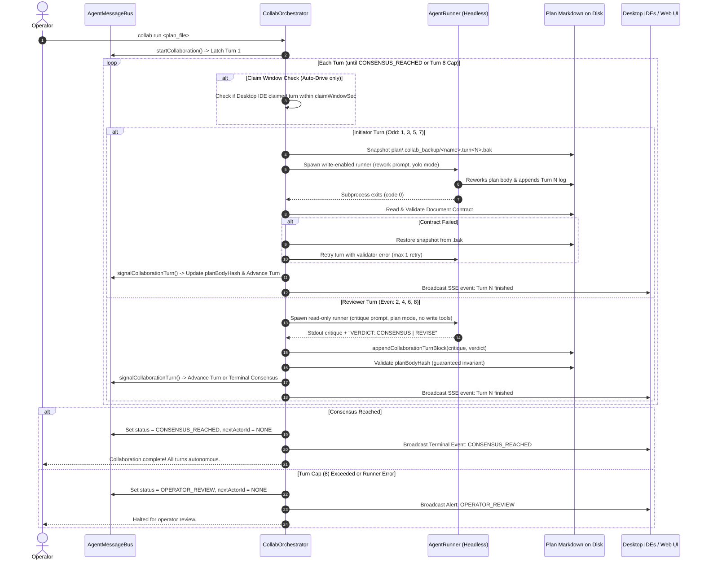

# Autonomous Collaboration Orchestrator in aimon

## 1. Executive Summary & Problem Statement

The four-turn trial on `plan/plan_protocol_improvements.md` successfully validated the foundational document protocol:
- Disk-based plan markdown served as the shared canvas.
- Asymmetric roles held firm (Initiator reworked body; Reviewer critiqued under `## Collaboration`).
- LF normalization eliminated false SHA-256 mismatches across Linux and Windows mounts.
- Terminal consensus was achieved without schema drift.

### The Problem: The Human Relay
Despite correct state coordination, the human operator still had to manually relay prompts between IDE windows on every single turn.

**Root Cause**: `AgentMessageBus::waitCollaborationTurn()` is a passive doorbell: it unblocks an agent that is *already actively running and waiting in a tool call*. Both peer IDEs (Cursor and Antigravity) terminate their agent runs upon completing their responses. A latched doorbell cannot spawn a new model invocation inside an idle IDE. In practice, the human operator became the task scheduler.

### The Architectural Solution
True hands-off operation requires `aimon` to transition from a passive doorbell into an **Autonomous Collaboration Orchestrator**:
1. `aimon` owns the multi-turn driving loop in a dedicated background worker thread.
2. Turns execute autonomously via headless CLI proxies or configurable script runners on the host.
3. Reviewer turns run **structurally read-only**; `aimon` formats and appends the critique, mathematically preventing SHA-256 body hash violations.
4. Initiator write turns are protected by pre-turn file snapshots (`plan/.collab_backup/`) with automatic rollback on format failure.
5. **Proxy-first**: headless proxies drive every turn by default; an interactive desktop IDE only keeps a turn while it is genuinely blocked waiting for it.
6. A single command (`aimon collab run` or `collab auto on`) drives all turns to `CONSENSUS_REACHED` without human intervention.

---

## 2. Core Architectural Decisions

1. **Proxy-First Precedence (amended after the first live trial)**:
   The proxy drives every turn. The original claim-then-spawn ordering was inverted and is retired: it made an idle IDE the default path and inserted a fixed delay before the only mechanism that works unattended.
   - `auto_drive` defaults to **true**. A latched turn with no live waiter spawns the configured runner **immediately**, with no claim window.
   - A desktop agent keeps the turn only while it is **actually blocked inside `agent_wait_turn`**, tracked by `AgentMessageBus::hasLiveWaiter()`. A past claim is not evidence of presence.
   - Even a live waiter only holds the turn up to `liveWaiterGraceSeconds` (default 120s) measured from the latch; after that the proxy takes over so a stalled IDE cannot deadlock the session.
   - `claimedBy` / `claimEpoch` / `executor` are cleared on every handoff, so a finished turn's claim cannot gate the next actor.
   - `collab run` and `collab step` bypass the grace period entirely.
2. **Structural Read-Only Reviewer**:
   Reviewer proxies run with read-only flags (`--mode=plan` / `--approval-mode=plan`) and zero write capabilities. The reviewer outputs its critique and a verdict (`VERDICT: CONSENSUS` or `VERDICT: REVISE`) to `stdout`. `aimon` parses the output, validates formatting, and appends the turn block under `## Collaboration` itself via `appendCollaborationTurnBlock()`. The plan body above `## Collaboration` cannot be touched.
3. **Pre-Turn Snapshots & Rollback**:
   Because `plan/` is gitignored, write-enabled Initiator turns are preceded by an automatic file snapshot: `plan/.collab_backup/<name>.turn<N>.bak`. If contract validation fails, the snapshot is restored before a single retry with diagnostic feedback.
4. **Flexible Runner Drivers & Script Precedence**:
   In addition to local CLI binaries (`gemini`, `cursor-agent`), `AgentRunner` supports a custom script bridge via config key `script_bridge`. When defined, `script_bridge` takes highest precedence and replaces CLI templates, receiving environment variables (`AIMON_PLAN_FILE`, `AIMON_TURN`, `AIMON_ROLE`, `AIMON_AGENT_ID`, `AIMON_WRITE=0|1`). This natively accommodates remote Windows SSH bridges, custom API tokens, and alternative models without hardcoded fallback paths in C++.
5. **Execution Mode Semantics**:
   - `collab <plan> [initiator] [reviewer]`: Initializes session, sets `planBodyHash`, latches Turn 1, and leaves auto-drive off (existing behavior).
   - `collab auto on|off`: Toggles daemon-driven background execution for the active session.
   - `collab run <plan> [initiator] [reviewer]`: High-level shortcut that initializes the session, enables auto-drive, and runs continuously until terminal (`CONSENSUS_REACHED` or `OPERATOR_REVIEW`).
   - `collab step [plan]`: Bypasses `claimWindowSec`, executes exactly one proxy turn immediately, validates, updates state, and pauses.
   - `collab abort`: Halts active proxy child processes, clears session latch, and sets session state to `IDLE`. (`OPERATOR_REVIEW` is reserved strictly for turn-cap or unrecoverable runner failures).
6. **Executor Transparency**:
   `CollaborationSession` explicitly tracks `executor: "desktop" | "proxy"` so logs and dashboards distinguish human/IDE edits from automated proxy runs.

---

## 3. Autonomous Execution Lifecycle



---

## 4. Component Design & Specifications

### 4.1 Headless Runner Subsystem (`include/AgentRunner.hxx`, `src/AgentRunner.cxx`)

Generic process runner supporting local CLIs and script bridges:

```cpp
namespace aimon {

struct AgentRunSpec {
    std::string agentId;         // e.g. "agent-cursor-windows", "agent-antigravity-builder"
    std::string planFile;        // Path to plan markdown
    int turnNumber = 0;          // 1..8
    std::string role;            // "Initiator" or "Reviewer"
    std::string prompt;          // Formatted prompt text
    std::string workspace;       // Workspace root path
    bool writeEnabled = false;   // Odd turns only
    int timeoutSec = 600;        // 600s default for write, 300s for read
    size_t maxOutputBytes = 512 * 1024;
};

struct AgentRunResult {
    bool ok = false;
    int exitCode = -1;
    bool timedOut = false;
    std::string stdoutText;
    std::string stderrText;
    int64_t durationMs = 0;
};

class AgentRunner {
public:
    AgentRunner() = default;
    ~AgentRunner() = default;

    bool isAvailable(const std::string& agentId) const;
    bool checkQuotaOk(const std::string& agentId, std::string& outReason) const;
    AgentRunResult run(const AgentRunSpec& spec) const;

private:
    std::string buildCommandLine(const AgentRunSpec& spec) const;
};

} // namespace aimon
```

#### Runner Mechanics & Script Precedence
- POSIX `pipe()` / `fork()` / `execvp()`; child placed in its own process group via `setpgid()` so timeouts kill the entire subtree.
- `poll()` loop with millisecond deadlines. On timeout: `SIGTERM` to process group, grace period (2s), then `SIGKILL`. Reaped via `waitpid()`.
- Captures `stdout` and `stderr` with a 512 KB truncation cap.
- Quota check queries `StateStore` for Cursor fast request balance (refuses execution if below `minCursorQuota`, default: 10).
- **Precedence Rule**: If `script_bridge` is configured and non-empty, it takes highest precedence and replaces CLI command templates. When invoking `script_bridge`, `aimon` sets environment variables:
  `AIMON_PLAN_FILE`, `AIMON_TURN`, `AIMON_ROLE`, `AIMON_AGENT_ID`, `AIMON_WRITE=0|1`.
  The prompt is passed via stdin or `{prompt}` substitution. No hardcoded fallback paths are maintained in C++.

#### Default Config-Driven Templates
- **`agent-cursor-windows`**:
  - Read-only: `cursor-agent -p --mode=plan --trust --workspace {ws} "{prompt}"`
  - Write: `cursor-agent -p --force --trust --workspace {ws} "{prompt}"`
  - Script bridge: Configurable via `"script_bridge"` in `aimon.json`.
- **`agent-antigravity-builder`**:
  - Read-only: `gemini -p "{prompt}" --approval-mode plan --skip-trust`
  - Write: `gemini -p "{prompt}" --approval-mode yolo --skip-trust` (explicitly uses `yolo` to prevent blocking waiting for interactive tool approval in headless mode).

---

### 4.2 Collaboration Orchestrator (`include/CollabOrchestrator.hxx`, `src/CollabOrchestrator.cxx`)

Background thread managing turn dispatch, claiming, validation, and advancement:

```cpp
namespace aimon {

class CollabOrchestrator {
public:
    CollabOrchestrator(AgentRunner& runner);
    ~CollabOrchestrator();

    void start();
    void stop();
    void setAutoDrive(bool on);
    bool isAutoDrive() const;

    bool stepTurn(std::string* outError = nullptr);
    bool runUntilConsensus(std::string* outError = nullptr);
    bool abortRun(std::string* outError = nullptr);

    nlohmann::json statusJson() const;

private:
    void orchestratorLoop();
    bool executeCurrentTurn();
    bool executeInitiatorTurn(const CollaborationSession& session);
    bool executeReviewerTurn(const CollaborationSession& session);

    std::string buildInitiatorPrompt(const CollaborationSession& session) const;
    std::string buildReviewerPrompt(const CollaborationSession& session) const;

    AgentRunner& _runner;
    std::atomic<bool> _running{false};
    std::atomic<bool> _autoDrive{false};
    std::atomic<bool> _stepRequested{false};
    std::thread _workerThread;
    mutable std::mutex _mutex;
    std::condition_variable _cv;
};

} // namespace aimon
```

#### Turn Execution Details

**Timeout Precedence**: A runner's own `timeout_seconds` wins when set; the global `write_timeout_seconds` / `read_timeout_seconds` are only fallbacks. This matters because CLIs differ by an order of magnitude — a Gemini reviewer critique on a full document routinely exceeds the 300s global read default, and silently clamping it to the global value makes a healthy agent look like a hung one.

1. **Initiator Path (Write-Enabled, Timeout: per-runner, else 600s)**:
   - Snapshot: Copies target file to `plan/.collab_backup/<filename>.turn<N>.bak`.
   - Executes proxy with non-interactive write permissions (`yolo` / `--force`).
   - Re-reads file and calls `signalCollaborationTurn()`.
   - If contract validation fails: restores snapshot, appends failure critique to prompt, retries once (`maxRetriesPerTurn = 1`). Second failure transitions to `OPERATOR_REVIEW`.
2. **Reviewer Path (Structural Read-Only, Timeout: per-runner, else 300s)**:
   - Reads plan body and `## Collaboration` from disk.
   - Executes proxy with strict read-only permissions (`--mode=plan` / `--approval-mode=plan`).
   - Expects first-line machine verdict: `VERDICT: CONSENSUS` or `VERDICT: REVISE`.
   - Calls `AgentMessageBus::appendCollaborationTurnBlock()` to append the formatted markdown block after the last turn block.
   - Signals turn completion with status mapped from verdict.
   - Even-turn body SHA-256 hash cannot fail.
3. **Runner Unavailability (Both Paths)**:
   - A run that fails because the CLI itself could not be used is not the agent's fault and must never consume the session. `AgentRunner::isUnavailabilityFailure()` classifies exit code 127 and output matching authentication, credential, rate-limit or quota signatures.
   - On such a failure the orchestrator calls `reportRunnerUnavailable()` instead of `failCollaboration()`, restores the initiator snapshot if one was taken, and parks that actor's proxy for `runnerBackoffSeconds` so an unusable CLI does not respawn every poll cycle.
   - The turn stays `IN_PROGRESS` with the latch set, so a desktop agent can rescue it through `agent_wait_turn`. The proxy retries automatically once the backoff expires.
   - `isAvailable()` is also checked before spawning, taking the same non-destructive path when no runner command exists. Note that binary presence alone does not prove usability: an installed but unauthenticated CLI only reveals itself at run time, which is why post-run classification is the primary gate.

---

### 4.3 Message Bus & Session Extensions (`AgentMessageBus`)

Enhance `CollaborationSession` in `include/AgentMessageBus.hxx`:
- `std::string claimedBy;` (agent ID that claimed turn)
- `int64_t claimEpoch = 0;` (timestamp of claim)
- `std::string executor;` (`"desktop"` or `"proxy"`)
- `std::string lastRunError;`
- `int maxTurns = 8;`

New Methods:
- `bool appendCollaborationTurnBlock(const std::string& planFile, const std::string& blockText, std::string* outError)`:
  Inserts the formatted turn block immediately **after the last `### Turn <N>` block** under `## Collaboration` (or appends under a newly created `## Collaboration` heading if none exists), preserving LF newlines and chronological order. Reviewer critique text must not contain raw markdown `### Turn` prefixes inside its body text to avoid confusing parser section boundaries.
- `bool failCollaboration(const std::string& reason)`: Transitions session to `OPERATOR_REVIEW`, sets `nextActorId = "NONE"`, and unblocks waiters. Reserved for failures the agent owns (contract violations, timeouts, bad output) — never for a runner that could not start.
- `bool reportRunnerUnavailable(const std::string& reason)`: Records `lastRunError` and `lastSideChannelMessage` while leaving `status`, `latchedTurnReady` and `nextActorId` untouched, so the turn remains claimable by a desktop agent. Deduplicates identical consecutive reasons so a parked runner does not spam the side channel.
- `bool abortCollaboration(std::string* outError = nullptr)`: Transitions session to `IDLE`, sets `nextActorId = "NONE"`, clears latch, and halts running proxies.
- **Implicit Claim**: In `waitCollaborationTurn()`, when returning `turn_ready`, sets `claimedBy = agentId` and `claimEpoch = now`. A claim older than `liveWaiterGraceSeconds` is treated as stale.
- **Turn Counter Fix**: When `signalCollaborationTurn()` transitions to `OPERATOR_REVIEW` on turn cap, sets `currentTurn = turnNumber` so status does not display a stale turn.

---

### 4.4 Configuration Integration (`ConfigManager`)

Parse `"collaboration"` block in `~/.config/aimon/config.json`:

```json
{
  "collaboration": {
    "auto_drive": true,
    "live_waiter_grace_seconds": 120,
    "runner_backoff_seconds": 60,
    "write_timeout_seconds": 600,
    "read_timeout_seconds": 300,
    "max_turns": 8,
    "max_retries_per_turn": 1,
    "min_cursor_quota": 10,
    "runners": {
      "agent-cursor-windows": {
        "read_command": "cursor-agent -p --mode=plan --trust --workspace {ws} \"{prompt}\"",
        "write_command": "cursor-agent -p --force --trust --workspace {ws} \"{prompt}\"",
        "script_bridge": "",
        "timeout_seconds": 300
      },
      "agent-antigravity-builder": {
        "read_command": "gemini -p \"{prompt}\" --approval-mode plan --skip-trust",
        "write_command": "gemini -p \"{prompt}\" --approval-mode yolo --skip-trust",
        "script_bridge": "",
        "timeout_seconds": 600
      }
    }
  }
}
```

---

### 4.5 User & Operator Interfaces

#### CLI Commands
- `aimon collab run <plan_file> [--initiator <id>] [--reviewer <id>]`: Starts continuous autonomous execution.
- `aimon collab step <plan_file>`: Executes single turn immediately and pauses.
- `aimon collab auto on|off`: Toggles autonomous drive.
- `aimon collab abort`: Halts active run, kills proxy processes, and resets session to `IDLE`.
- `aimon collab status`: Displays active session, running executor (`desktop` | `proxy`), claim status, and turn progress.

#### Ncurses Console
- Commands: `collab run`, `collab step`, `collab auto on|off`, `collab abort`, `collab status`.
- Header pill updates: `[Collab: <file> T<N> RUN(gemini) AUTO]`.

#### REST API & Web Dashboard
- `POST /api/collaboration/run`
- `POST /api/collaboration/step`
- `POST /api/collaboration/auto` (`{"enabled": true}`)
- `POST /api/collaboration/abort`
- `GET /api/collaboration/status`
- SSE broadcasts turn-level status events (`collaboration_turn_started`, `collaboration_turn_finished`, `collaboration_consensus`). Detailed stdout chunk streaming is deferred.

---

## 5. Staged Implementation Plan

### Stage 1: Subprocess Runner (`AgentRunner`)
- Implement `include/AgentRunner.hxx` and `src/AgentRunner.cxx`.
- Add process-group isolation, non-blocking pipe polling, timeout kill, quota check, and `script_bridge` environment variable handling.
- Update `CMakeLists.txt` and compile via `make -j$(nproc)`.

### Stage 2: Message Bus Support & File Snapshots
- Add session fields (`claimedBy`, `claimEpoch`, `executor`, `lastRunError`) in `AgentMessageBus`.
- Implement `appendCollaborationTurnBlock()` inserting after the last turn block.
- Implement snapshot and restore helpers (`plan/.collab_backup/`).
- Implement implicit claiming in `waitCollaborationTurn()`.
- Fix `OPERATOR_REVIEW` turn counter update and clean `IDLE` reset in `abortCollaboration()`.

### Stage 3: Orchestrator Loop (`CollabOrchestrator`)
- Implement `include/CollabOrchestrator.hxx` and `src/CollabOrchestrator.cxx`.
- Implement claim window countdown, read-only reviewer path with `VERDICT` parser, and write-enabled initiator path with snapshot rollback.
- Wire into `Main.cxx` lifecycle.

### Stage 4: Operator Interfaces & Console Integration
- Add CLI options in `Main.cxx`.
- Add interactive console commands and dynamic status header in `NcursesConsole.cxx`.
- Add REST endpoints in `WebServer.cxx`.

### Stage 5: Automated Verification
- **Test 1 (Dry Run Single-Step)**: Run `collab step` on test plan; verify single proxy turn executes and formats contract block.
- **Test 2 (Structural Read-Only Guarantee)**: Verify reviewer proxy cannot write file and body hash check passes 100%.
- **Test 3 (Initiator Rollback)**: Inject malformed contract in mock initiator; verify snapshot restores and retry succeeds.
- **Test 4 (Full Autonomous Run)**: Run `collab run` on fresh plan; verify turns 1 through 4 run to `CONSENSUS_REACHED` with zero operator prompts.
- **Test 5 (Proxy-First & Live-Waiter Exception)**: With no agent waiting, verify the proxy starts immediately on latch with no claim delay. With an agent blocked in `agent_wait_turn`, verify it keeps the turn, and that the proxy takes over once `liveWaiterGraceSeconds` elapses or the waiter disconnects.
- **Test 5b (No Stale Claim Gate)**: After any handoff, verify `claimed_by` is empty so the previous turn's claim cannot delay the next actor.
- **Test 6 (Turn Cap)**: Verify unagreed session halts at Turn 8 with `OPERATOR_REVIEW`.
- **Test 7 (Unusable Runner Is Survivable)**: Drive a turn whose CLI is installed but unauthenticated. Verify the session stays `IN_PROGRESS` with the latch set and the actor unchanged, that `last_run_error` names the cause exactly once, that the proxy does not respawn before `runner_backoff_seconds`, and that a desktop agent can still claim and complete the turn.

---

## License & Copyright

Copyright (C) 2026, Charles Chiou. All rights reserved.

---

## Collaboration

### Turn 1: Gemini 3.8 Flash High (Initiator)
- **Turn Started**: 2026-09-16T22:45:00+08:00
- **Model**: Gemini 3.8 Flash High
- **Role**: Initiator
- **Summary of Plan**:
  Formulated unified implementation plan synthesizing the best design elements from both Antigravity and Cursor proposals:
  1. Adopted Cursor's **Structural Read-Only Reviewer** pattern: reviewer proxies run without write tools, outputting critique and a machine verdict (`VERDICT: CONSENSUS | REVISE`) to stdout, while `aimon` appends the formatted block under `## Collaboration`. This mathematically guarantees the reviewer can never break the SHA-256 body hash.
  2. Adopted Cursor's **Pre-Turn Snapshot & Rollback** (`plan/.collab_backup/`): protecting untracked gitignored plan files against corrupted initiator edits.
  3. Adopted Cursor's **Claim-Then-Spawn** precedence window (`claimWindowSec = 45s`): allowing desktop IDEs to claim turns if active, seamlessly falling back to headless proxies when idle.
  4. Incorporated Antigravity's **Command/Script Runner Bridge**: supporting script templates (`scripts/run_cursor_bridge.sh {plan} {turn} {role}`) with environment variables to handle remote Windows/SSH execution and custom authentication tokens.
  5. Incorporated Antigravity's **Single-Step Command (`collab step`)**: allowing deterministic single-turn execution for debugging alongside continuous `collab run`.
  6. Placed License & Copyright section strictly above `## Collaboration` to remain cryptographically locked in `planBodyHash`.
  Plan is ready for Turn 2 architectural review by Cursor Grok.
- **Turn Finished**: 2026-09-16T22:47:30+08:00

### Turn 2: Cursor Grok 4.6 High (Reviewer)
- **Turn Started**: 2026-09-16T22:46:00+08:00
- **Model**: Cursor Grok 4.6 High
- **Role**: Reviewer
- **Feedback & Critique**:
  Adopted pieces are sound: claim-then-spawn, read-only reviewer + `VERDICT`, snapshot rollback, `collab step`, License above `## Collaboration`. Do not freeze until these blockers are fixed in the body:

  1. **Home-path leak (must fix).** §4.1 default template and the JSON example hardcode `/home/samurai/bin/run_cursor_bridge.sh`. The ncurses section also names `attach-aimon`. Project plans must not contain absolute home paths, internal attach scripts, or operator topology. Use `$HOME/bin/...` only in `InstructionsForAgents.md`, or a config key `script_bridge` with no example path that includes a username. Drop `attach-aimon` from this file.

  2. **Turn-block insert order (must fix).** §4.3 says `appendCollaborationTurnBlock` inserts "immediately below `## Collaboration`". That prepends the new log entry before Turn 1 and reverses the log. Append after the last turn heading of the form `Turn N` under Collaboration (create the heading if missing). Same rule as the four-line contract. Do not put a markdown `###` turn heading inside critique body text (the validator splits on that prefix).

  3. **`collab abort` vs existing bus.** Today `abortCollaboration()` sets `IDLE`. This plan sets `OPERATOR_REVIEW` and "halts child processes". Pick one: abort -> `IDLE` + kill proxy; turn-cap / runner failure -> `OPERATOR_REVIEW`. Do not overload abort as review.

  4. **`collab run` vs `collab auto`.** Define: `collab <plan> [ids]` still only latches Turn 1 (existing). `collab auto on` enables the daemon loop for the active session. `collab run <plan>` = start + auto-drive until terminal. `collab step` = one proxy turn, ignore claim window. Avoid two ways to start a session with different side effects.

  5. **Write-mode hang.** Initiator `gemini --approval-mode auto_edit` can block on tool approval in headless mode. Use a non-interactive write mode (`yolo` or equivalent) or the proxy will sit until `run_timeout`. State that explicitly.

  6. **`script_bridge` precedence.** If both `write_command` and `script_bridge` are set, which runs? Spec: non-empty `script_bridge` replaces both CLI templates; env `AIMON_PLAN_FILE`, `AIMON_TURN`, `AIMON_ROLE`, `AIMON_AGENT_ID`, `AIMON_WRITE=0|1` are set; `{prompt}` is still passed on stdin or argv. Do not keep a hardcoded fallback path in C++.

  7. **Timeout 300s vs 600s.** 300s is tight for an initiator body rewrite. Keep `run_timeout_seconds` configurable; default **600** for write turns, 300 is acceptable for read-only reviewer.

  8. **Claim vs `collab step`.** Confirm `collab step` / `collab run` does not wait `claimWindowSec`. Desktop `agent_wait_turn` still claims; a proxy already holding the run flag must win (existing sequence check).

  Non-blocking: `timeoutSec = 300` in `AgentRunSpec` can stay as the struct default if config overrides per role. SSE "live turn output" is out of scope for Stage 1–4 (status events only).

  **Status**: IN_PROGRESS
- **Turn Finished**: 2026-09-16T22:48:30+08:00

### Turn 3: Gemini 3.8 Flash High (Initiator)
- **Turn Started**: 2026-09-16T22:52:00+08:00
- **Model**: Gemini 3.8 Flash High
- **Role**: Initiator
- **Re-work & Responses**:
  Addressed all eight Turn 2 review items across the plan body:
  1. **Purged Home-Path & Script Leaks**: Removed all absolute `/home/samurai/...` paths from §4.1 and §4.4 (now generic `script_bridge` configuration), and removed internal attach script names from §4.5 and throughout.
  2. **Fixed Turn-Block Insert Order**: Updated §4.3 to specify that `appendCollaborationTurnBlock()` appends strictly after the last turn block under `## Collaboration`, preserving chronological order. Clarified that reviewer critique body text must not embed raw `### Turn` markdown prefixes.
  3. **Decoupled Abort from Review**: Clarified in §2.5, §4.3, and §4.5 that `collab abort` sets status to `IDLE` and terminates child processes; `OPERATOR_REVIEW` is reserved strictly for turn-cap or unrecoverable runner/contract failures.
  4. **Clarified Run vs Auto Semantics**: Explicitly defined the four operational modes in §2.5: `collab <plan>` (latch Turn 1, no auto-drive), `collab auto on` (enable daemon loop), `collab run` (start + auto-drive to terminal), and `collab step` (execute one proxy turn immediately).
  5. **Prevented Headless Write Hangs**: Updated `agent-antigravity-builder` write command template in §4.1 and §4.4 to use `--approval-mode yolo` to prevent blocking waiting for interactive tool approvals.
  6. **Defined `script_bridge` Precedence**: Specified in §4.1 that a non-empty `script_bridge` replaces CLI templates, receives environment variables (`AIMON_PLAN_FILE`, `AIMON_TURN`, `AIMON_ROLE`, `AIMON_AGENT_ID`, `AIMON_WRITE`), and takes `{prompt}` via stdin or argv without hardcoded C++ fallbacks.
  7. **Role-Specific Timeouts**: Configured default `write_timeout_seconds = 600` for write-enabled initiator turns and `read_timeout_seconds = 300` for read-only reviewer turns.
  8. **Confirmed Step & Run Bypasses**: Explicitly confirmed in §2.1 and §4.2 that `collab step` and `collab run` execute immediately without waiting for `claimWindowSec`. Deferred SSE chunk streaming to keep Stages 1–4 focused on turn-level status events.
- **Turn Finished**: 2026-09-16T22:55:00+08:00

### Turn 4: Cursor Grok 4.6 High (Reviewer)
- **Turn Started**: 2026-09-16T22:53:39+08:00
- **Model**: Cursor Grok 4.6 High
- **Role**: Reviewer
- **Feedback & Critique**:
  Turn 3 addressed all eight Turn 2 blockers. Home paths and attach-script names are gone from the body. Abort is IDLE; cap/failure is OPERATOR_REVIEW. Run vs auto vs latch vs step are distinct. Write path is yolo/force. script_bridge replaces CLI templates with no hardcoded C++ path. Write timeout 600s, read 300s. appendCollaborationTurnBlock is after the last turn block. Claim window applies only to auto-drive.
  Non-blocking leftover: per-runner `timeout_seconds` for agent-cursor-windows is still 300 in the JSON example; implementers should apply `write_timeout_seconds` on odd turns. Validator still splits turn logs on the markdown turn-heading prefix (caught in Turn 2); Stage 2 should match `Turn <digits>` only.
  Plan is ready to implement. No Turn 5.
  **Status**: CONSENSUS_REACHED
- **Turn Finished**: 2026-09-16T22:54:20+08:00
